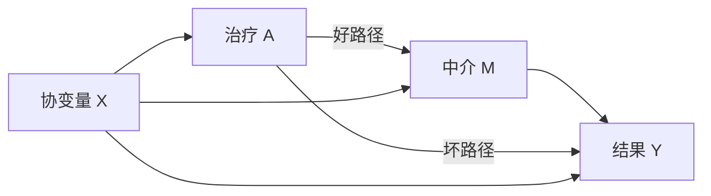
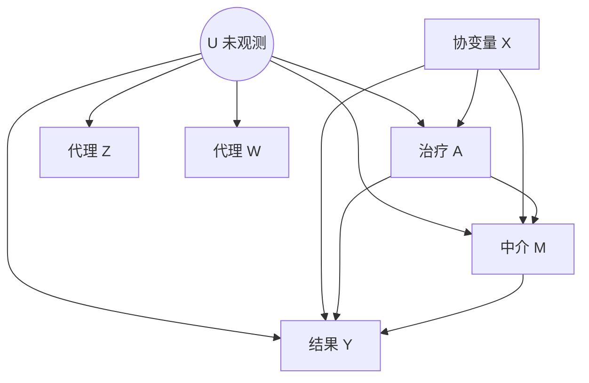
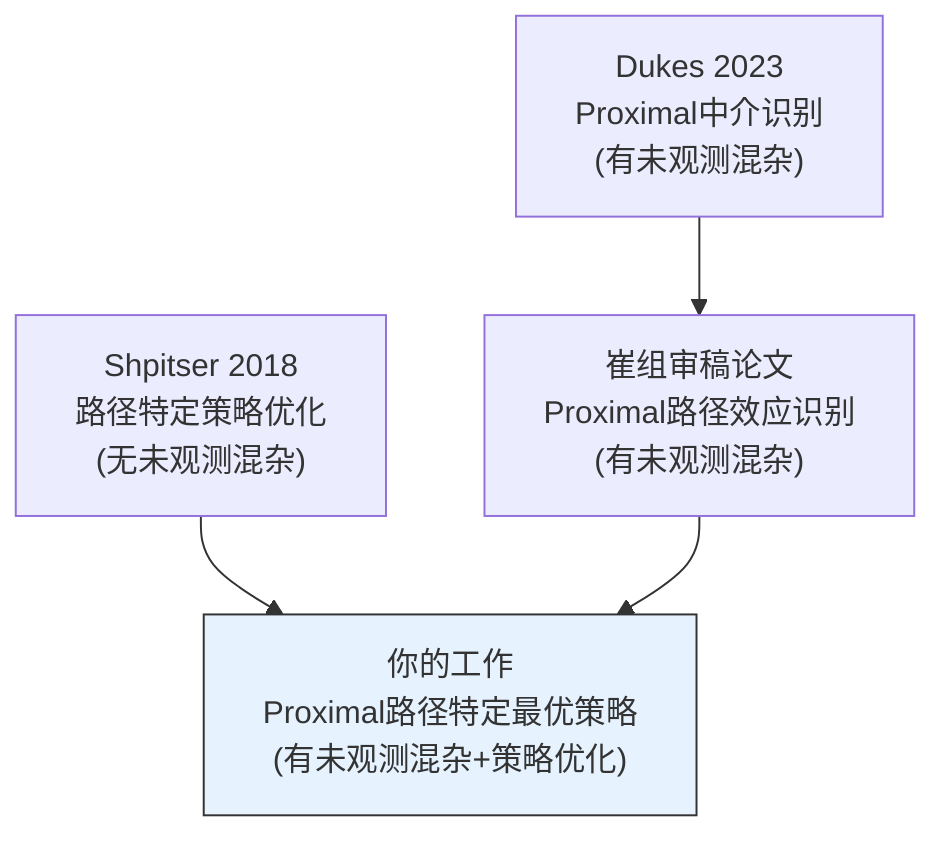

# Topic 1: Specific Pathway Optimal Regime

> 路径特定最优治疗策略 | 提出者: 郭源善 | 难度 ★★☆

## 目录

- [研究背景](#研究背景)
- [论文一: Shpitser & Sherman 2018](#论文一-shpitser--sherman-2018)
- [论文二: Dukes et al. 2023 (Proximal Mediation)](#论文二-dukes-et-al-2023)
- [现有Gap与研究方向](#现有gap与研究方向)
- [如何推进这个方向](#如何推进这个方向)

---

## 研究背景

在精准医疗中, 我们不仅关心一个治疗对结果的总效应, 更关心它是通过什么机制产生效果的. 比如一种HIV药物同时通过化学作用和患者依从性两条路径影响疗效, 我们可能只想优化化学作用这条路径, 同时把依从性固定在某个参考水平.

传统的因果推断方法要么只看总效应, 要么只分解效应但不做决策优化. 这个题目的核心思想是把中介分析(分解效应)和动态治疗策略(做决策)结合起来, 在特定路径上寻找最优策略.

### 问题结构



目标: 找到一个策略 f(X), 使得好路径上的效应最大化, 同时把坏路径固定在参考水平.

---

## 论文一: Shpitser & Sherman 2018

**Identification of Personalized Effects Associated With Causal Pathways**

Johns Hopkins University | UAI 会议 | 文件: 198.pdf | 10页

### 问题定义

传统的动态治疗策略(Dynamic Treatment Regime, DTR)考虑的是: 给定患者特征X, 选择一个治疗A来最大化 E[Y(A=f(X))]. 这里优化的是A对Y的总效应.

但在很多临床场景下, 治疗通过多条因果路径影响结果, 这些路径并非都是我们希望优化的. Shpitser这篇文章定义了一类新的反事实量, 叫做边特定策略(edge-specific policy)的响应, 并给出了对应的识别理论.

### 核心方法

#### 边干预 (Edge Intervention)

普通的do干预是把整个变量设为某个值, 比如 do(A=1) 表示强制所有人接受治疗. 边干预则更精细, 它对因果图中的特定边(箭头)进行干预.

```
因果图:  A --边1--> M --边2--> Y
         A --------边3-------> Y
```

边干预允许我们在不同边上使用不同的干预值. 比如:
- 在边1(A到M)上设 A=1
- 在边3(A到Y)上设 A=0

这样就能隔离出A通过M影响Y的那条路径的效应.

对应的数学表达是 Y(a^{A→M}, a'^{A→Y}), 表示在M的路径上A取值a, 在Y的直接路径上A取值a'.

#### 边特定g公式 (Edge g-formula)

在标准因果模型(所有变量可观测)下, 边特定干预的反事实分布可以用以下公式识别:

```
p(Y(a^{→M}, a'^{→Y})) = Σ_M Σ_W p(Y|a,M,W) · p(M|a',W) · p(W)
```

这个公式的直觉是: Y的分布取决于直接路径上的干预值a, 而M的分布取决于间接路径上的干预值a'. 两者可以不同.

#### 从干预到策略

干预是把变量设为固定值, 策略是把变量设为依赖其他变量的函数. 边特定策略就是在每条边上使用不同的策略函数:

```
f = {f_{A→M}: X → A,  f_{A→Y}: X → A}
```

论文中给出了 edge g-formula 的策略版本:

```
p(Y(f)) = Σ_M Σ_W p(Y|f_{A→Y}(W), M, W) · p(M|f_{A→M}(W), W) · p(W)
```

#### ID算法的完备性

论文最重要的理论贡献: 证明了对于任意的边特定策略, 如果其反事实响应能被识别, ID算法一定能识别出来(完备性, completeness). 换言之, 不存在 ID算法漏掉的情况.

### 关键假设

这篇论文的一个重要限制是假设不存在未观测混杂. 因果图中所有变量都是可观测的, 没有隐藏的共同原因U.

### 实际应用

论文以HIV治疗为例:
- A = 药物选择
- M = 服药依从性
- Y = 病毒学失败
- 化学效应路径: A → Y (直接)
- 依从性效应路径: A → M → Y (间接)

目标是找到一个策略, 最大化化学效应路径上的疗效, 同时把依从性固定在某个参考药物的水平. 这样可以找到化学效果最好的药, 而不是综合效果最好的药.

### 论文的贡献与局限

| 方面 | 内容 |
|------|------|
| 贡献 | 首次定义了边特定策略的反事实量, 给出了完备的识别算法 |
| 局限 | 假设无未观测混杂, 限制了在观测数据(如EHR)中的适用性 |

---

## 论文二: Dukes et al. 2023

**Proximal Mediation Analysis**

UPenn + Johns Hopkins | arXiv 2023 | 文件: Proximal Mediation Analysis.pdf | 53页

> 这篇论文同时是题目4和题目5的基础论文, 这里只介绍与题目1相关的部分.

### 与题目1的关联

Dukes这篇论文解决了在有未观测混杂时如何识别中介效应的问题. 它的proximal框架提供了处理隐藏混杂的工具, 但它关注的是效应估计, 不是策略优化.

题目1的想法是: 把Dukes的proximal识别结果作为输入, 套到Shpitser的策略优化框架中.

### 因果图



与Shpitser的区别: 多了一个不可观测的U, 以及两个代理变量Z和W.

### 关键结果

论文通过桥函数(bridge function)的技术手段, 在存在U的情况下仍然能识别中介效应. 具体包括三种识别策略, 以及一个多重稳健(multiply robust)的估计量PMR.

详细的技术内容见题目4和题目5的综述文档.

---

## 现有Gap与研究方向



### Gap 1: 未观测混杂下的策略优化

Shpitser的方法假设所有变量可观测. 但在EHR等观测数据中, 总有看不到的混杂因子. 如何在proximal框架下做路径特定的策略优化, 目前没有人做过.

### Gap 2: 从识别到优化

崔组有一篇正在审稿的论文(需要到浙大线下看), 已经在proximal框架下做了路径特定效应的识别. 但识别只是告诉你效应有多大, 没有回答如何选择最优策略.

---

## 如何推进这个方向

### 技术路线

1. 从审稿论文中获取proximal框架下路径特定效应的识别公式(类似于一个value function)
2. 把这个识别公式代入Shpitser的策略优化框架
3. 推导出最优策略的形式
4. 可以套一个Q-learning或A-learning的框架来求解
5. 通过模拟实验验证方法

### 论文结构预期

```
Introduction: 精准医疗中路径特定决策的需求
Background: Shpitser的框架 + Proximal CI基础
Method: Proximal edge-specific optimal regime
  - 识别结果(来自审稿论文)
  - 策略优化框架(来自Shpitser)
  - 估计方法(可能需要套RL的框架)
Simulation: 与naive方法(忽略U)和total-effect策略比较
Discussion: 局限性和扩展方向
```

### 预期产出

吴思涵说这个题目"套了强化学习的皮, 可能更容易发". 预期可以投NeurIPS/ICML的Causal Inference workshop, 或者统计方向的期刊如JASA, Biometrika.

### 前置条件

必须先到浙大线下看那篇审稿中的论文, 才能真正开始推导. 建议5月初去一趟.
