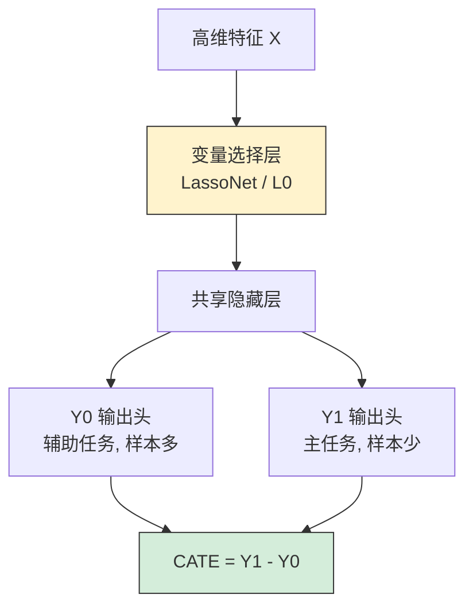
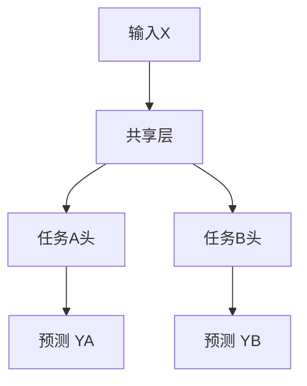
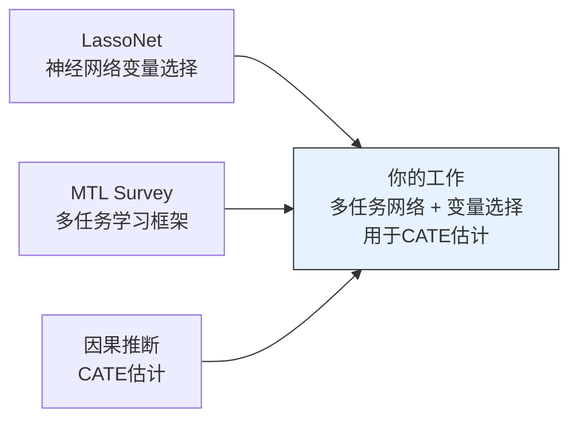

# Topic 2: Hierarchical Learning and Feature Selection for Conditional Counterfactual Mean Estimation

> 层次学习与特征选择用于条件反事实均值估计 | 难度 ★★★

## 目录

- [研究背景](#研究背景)
- [论文一: LassoNet (JMLR 2021)](#论文一-lassonet)
- [论文二: Nonlinear Variable Selection (JCGS 2021)](#论文二-nonlinear-variable-selection)
- [论文三: Multi-Task Learning Survey (arXiv 2020)](#论文三-multi-task-learning-survey)
- [现有Gap与研究方向](#现有gap与研究方向)
- [如何推进这个方向](#如何推进这个方向)

---

## 研究背景

在因果推断中, 估计条件平均处理效应(CATE)是核心任务之一. CATE = E[Y(1) - Y(0) | X = x] 描述了对于特征为x的个体, 接受治疗相比不接受治疗的预期收益.

一个实际的困难是: 接受治疗的人(Y(1)可观测)往往比不接受治疗的人(Y(0)可观测)少得多. 比如临床试验中用药组通常比对照组小. 这意味着估计Y(1)的条件期望时可用的样本更少, 估计精度更差.

这个题目的核心想法: 利用多任务学习的框架, 用Y(0)的信息(样本多)来辅助Y(1)的估计(样本少), 同时通过神经网络的变量选择去掉噪声特征.

### 方法框架图



---

## 论文一: LassoNet

**LassoNet: A Neural Network with Feature Sparsity**

Lemhadri, Ruan, Abraham, Tibshirani | Stanford | JMLR 2021 | 文件: 20-848 (1).pdf | 29页

### 问题

传统Lasso只能在线性模型中做变量选择. 神经网络虽然能拟合复杂的非线性关系, 但没有内置的特征选择机制. 当特征维度很高(比如蛋白质组学数据有上千个特征)时, 噪声特征会降低模型性能.

LassoNet的目标是在神经网络中实现像Lasso一样的全局特征选择.

### 网络结构

```
输入 X₁ X₂ ... Xₚ
  │                │
  │    ┌───────────┘
  │    │     Skip Layer (残差连接)
  │    │     θ₁  θ₂ ... θₚ
  │    │         │
  ▼    ▼         ▼
 隐藏层 ────────→ ⊕ → 输出
```

关键设计: 在标准神经网络的基础上加了一个skip layer, 输入直接连到输出. 每个特征 Xⱼ 在skip layer中有一个对应的权重 θⱼ.

### 强层次约束 (Strong Hierarchy Constraint)

这是LassoNet最核心的创新. 约束条件为:

对于第j个特征, 隐藏层第一层中所有与 Xⱼ 相关的权重的最大绝对值, 不能超过 M 乘以 skip layer 权重的绝对值:

```
max_k |W_{jk}^{(1)}| ≤ M · |θⱼ|
```

这意味着: 当skip layer中 θⱼ 被L1正则化压到零时, 隐藏层中所有使用 Xⱼ 的权重也必须为零. 整个特征 Xⱼ 被彻底关掉.

### 优化方法

目标函数: 最小化预测损失 + λ · Σⱼ|θⱼ|

由于有层次约束, 不能直接用标准梯度下降. 论文采用 Projected Proximal Gradient Descent:

1. 对所有参数做一步梯度下降
2. 对skip layer权重做proximal更新(soft-thresholding)
3. 把隐藏层权重投影到满足约束的集合上

### 正则化路径

改变λ从小到大, 可以得到一条路径:
- λ小: 所有特征都活跃
- λ增大: 不重要的特征逐渐被关掉
- λ大: 只剩最重要的几个特征

可以画出一张图, 横轴是λ, 纵轴是每个特征的skip layer权重. 类似于经典Lasso的正则化路径图.

### 实验结果

在MICE蛋白质数据集(77个特征, 8个分类)上, 只需约35个特征就能达到最优分类精度. LassoNet在精度和稀疏性之间的权衡优于其他方法(如dropout, group lasso等).

### 与本题目的关联

LassoNet提供了在神经网络中做全局变量选择的技术工具. 在本题目中, 变量选择的作用是: 去掉噪声特征 → 减少网络宽度 → 在Y(1)样本少的情况下减少过拟合.

---

## 论文二: Nonlinear Variable Selection

**Nonlinear Variable Selection via Deep Neural Networks**

Chen, Gao, Liang, Wang | Purdue University | JCGS 2021 | 文件: Nonlinear Variable Selection... .pdf | 10页

### 问题

与LassoNet相同: 在神经网络中做非线性变量选择. 但用了不同的架构和约束.

### 方法

网络分为两部分:

```
输入 X₁...Xₚ → [选择层 s₁...sₚ] → 筛选后的特征 → [深度网络] → 输出Y
                  ↑
              L0约束(限制非零个数)
```

选择层(selection layer)是一个对角矩阵, 对角元素 sⱼ 控制第j个特征是否被保留. 用L0约束(直接限制非零元素个数)来稀疏化.

### L0约束的处理

L0约束本质上是NP-hard的组合优化问题. 论文采用连续松弛的方法来近似求解:
- 用一个连续的代理函数来近似L0范数
- 在优化过程中交替更新选择层和近似层的参数

### 理论贡献

论文在广义稳定受限Hessian(Generalized Stable Restricted Hessian, GSRH)条件下证明了:
- 算法收敛到稳定点
- 变量选择具有一致性(大样本下能选出真正重要的变量)

这个理论结果把高维线性回归中已知的变量选择一致性推广到了深度神经网络.

### 与LassoNet的对比

| 维度 | LassoNet | Nonlinear VarSel |
|------|----------|-----------------|
| 稀疏化方式 | L1 + 层次约束 | L0 + 连续松弛 |
| 网络结构 | skip layer + 隐藏层 | 选择层 + 近似层 |
| 理论保证 | 正则化路径 | 选择一致性 |
| 实现复杂度 | 较低(投影梯度) | 中等(交替优化) |
| 可解释性 | 路径图直观 | 二值选择直观 |

### 与本题目的关联

提供了另一种变量选择工具. 可以在实验中比较两种方法, 或者选择其中效果更好的一种.

---

## 论文三: Multi-Task Learning Survey

**Multi-Task Learning with Deep Neural Networks: A Survey**

Crawshaw | George Mason University | arXiv 2020 | 文件: 2009.09796v1.pdf | 43页

### 核心思想

多任务学习(MTL)的基本假设: 如果多个任务之间存在关联, 那么联合学习比独立学习更高效. 共享的底层表示可以捕捉任务之间的共性, 同时减少过拟合.

### 两种基本范式

#### 硬参数共享 (Hard Parameter Sharing)



所有任务共用底层网络参数, 只有顶层输出头不同. 这是最常用的方式, 计算开销小, 正则化效果好.

#### 软参数共享 (Soft Parameter Sharing)

每个任务有独立的网络, 但通过正则化项鼓励不同网络的参数相似. 灵活度更高, 但参数量更大.

### MTL为什么有效

1. 隐式数据增强: 辅助任务提供了额外的训练信号, 相当于增加了有效样本量
2. 正则化: 多任务的梯度信号互相约束, 防止模型过度拟合某个任务
3. 特征学习: 共享层被迫学习对多个任务都有用的通用表示

### 任务权重

不同任务对总损失函数的贡献如何权衡是MTL的核心问题. 综述介绍了几种方法:

| 方法 | 思路 | 优点 | 缺点 |
|------|------|------|------|
| 固定权重 | 手动设定 | 简单 | 需要调参 |
| Uncertainty Weighting | 根据任务不确定度自动调整 | 自适应 | 假设高斯噪声 |
| GradNorm | 根据梯度范数动态调整 | 平衡训练速度 | 额外计算开销 |
| MGDA | 多目标优化 | 理论优美 | 计算复杂 |

### 负迁移 (Negative Transfer)

当任务之间关联不强甚至冲突时, 联合训练可能反而降低性能. 这是MTL的主要风险.

判断是否会发生负迁移的方法:
- 任务相关性分析(特征重叠度)
- 训练中监控各任务的验证损失
- 使用soft sharing减少强制共享带来的冲突

### 与本题目的关联

本题目的核心就是一个MTL问题:
- 主任务: 估计 E[Y(1)|X](用药后的结果, 样本少)
- 辅助任务: 估计 E[Y(0)|X](不用药的结果, 样本多)

通过共享底层网络, 让Y(0)的大量数据帮助Y(1)的学习.

---

## 现有Gap与研究方向



### Gap 1: MTL与因果推断的setting不匹配

原始MTL假设同一个样本有多个标签(比如一张图片同时有类别标签和物体位置标签). 但在因果推断中, Y(0)和Y(1)是互斥的, 你永远观测不到同一个人的两个potential outcome. 这意味着原始论文的理论证明不能直接搬过来.

### Gap 2: 变量选择在因果框架下的理论性质

LassoNet和Nonlinear VarSel的理论结果(选择一致性等)都是在标准监督学习的框架下证明的. 在因果框架(特别是存在混杂的情况下), 这些理论性质是否仍然成立, 需要重新分析.

### Gap 3: 没有人把变量选择和MTL同时应用于CATE估计

现有的CATE估计方法(如causal forest, R-learner, DR-learner)没有内置的变量选择机制, 也没有利用Y(0)样本量大这一结构.

---

## 如何推进这个方向

### 方法设计

```
输入: 高维特征 X (p维)
      治疗组: {(Xᵢ, Yᵢ) : Aᵢ=1}  (n₁个样本, 较少)
      对照组: {(Xᵢ, Yᵢ) : Aᵢ=0}  (n₀个样本, 较多)

网络结构:
  X → LassoNet选择层 (稀疏化, 去掉噪声特征)
    → 共享隐藏层 (学习通用表示)
      → Y(0)输出头 (用对照组训练)
      → Y(1)输出头 (用治疗组训练)

损失函数:
  L = w₀ · L₀(对照组) + w₁ · L₁(治疗组) + λ · Σ|θⱼ|

CATE估计:
  τ̂(x) = ŷ₁(x) - ŷ₀(x)
```

### 需要重新推导的理论

1. 在Y(0)和Y(1)互斥的setting下, 共享层的收敛性分析
2. 变量选择一致性在因果框架下的条件
3. CATE估计量的渐近性质(一致性, 渐近正态性)

### 预期难度

这是五个题目中最难的, 因为需要推导新的理论. 但如果做出来, 因为有genuine novelty(新定理), 可以冲期刊(如AOS, JASA)或顶会主会(NeurIPS, ICML).

### 论文结构预期

```
Introduction: CATE估计的需求 + 高维+不平衡样本的挑战
Related Work: MTL + 变量选择 + CATE估计
Method: 网络结构 + 损失函数 + 理论分析
  - Theorem 1: 变量选择一致性
  - Theorem 2: CATE估计的收敛速率
Experiments: 模拟 + 可能的真实数据
Discussion: 与proximal框架结合的可能性
```

> 注意: 有一篇核心论文(Sparse Neural Networks via Auxiliary Responses)正在审稿中, 需要到浙大后线下阅读. 这篇论文是本题目的直接前驱工作.
