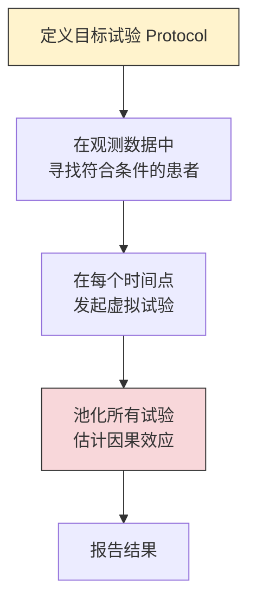
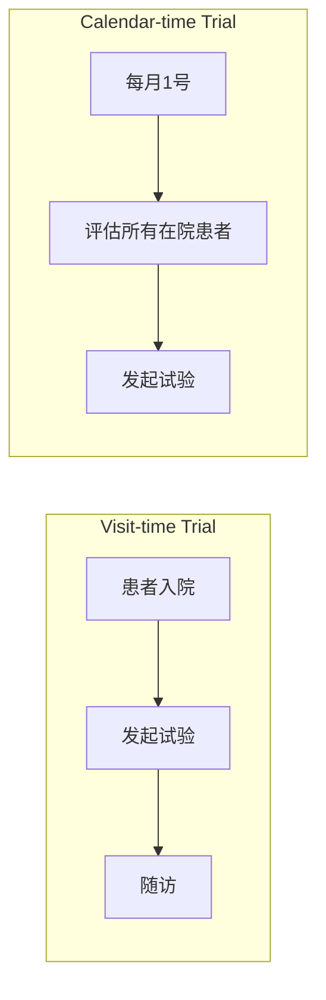
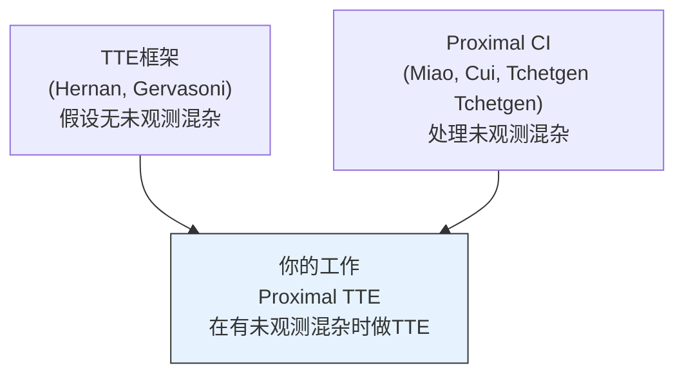

# Topic 3: Proximal Target Trial Emulation

> 近端因果推断下的目标试验模拟 | 提出者: 郭源善 | 难度 ★★★ (探索性)

## 目录

- [研究背景](#研究背景)
- [论文: Gervasoni et al. 2026](#论文-gervasoni-et-al-2026)
- [现有Gap与研究方向](#现有gap与研究方向)
- [如何推进这个方向](#如何推进这个方向)

---

## 研究背景

临床研究的金标准是随机对照试验(RCT), 但很多时候做不了: 成本高, 周期长, 存在伦理限制. Target Trial Emulation(TTE)的思路是用已有的观测数据(比如EHR)来模拟一个假想的RCT.

TTE由Harvard的Miguel Hernan提出, 近年来在流行病学和临床研究中被广泛采用. 它的核心要求是: 明确定义你想模拟的那个试验的所有要素(入组标准, 治疗方案, 随访策略, 结局定义), 然后在观测数据中尽可能忠实地复现.

### TTE的基本流程



步骤D(池化和估计)是目前问题最多的环节, 也是这篇论文要解决的.

---

## 论文: Gervasoni et al. 2026

**On Estimands in Target Trial Emulation**

Gervasoni, De Bus, Vansteelandt, Dukes | Ghent University | 2026年1月 | 文件: TTE.pdf | 38页

### 核心论点

传统的TTE分析使用参数模型(Cox回归或logistic回归)来分析池化后的数据. 这篇论文指出这种做法有三个严重问题, 并提出了以estimand(估计目标)为中心的新策略.

### 问题一: 参数模型设定风险

传统分析通常假设:
```
log[h(t|A,L)] = β₀(t) + β₁·A + β₂·L
```
如果真实的治疗效应不是在对数尺度上的加法关系, 或者与协变量L有交互作用, 这个模型就是错误的, 估计结果会有偏.

### 问题二: 不可合并性 (Noncollapsibility)

这是一个经常被忽视但影响很大的问题.

考虑一个简单的例子: 假设真实的条件 odds ratio 在每个亚组中都是 OR = 2. 直觉上, 如果把所有亚组混在一起, 边际OR应该也是2. 但事实上不是. 边际OR可能大于2也可能小于2, 取决于亚组的分布.

这不是因为存在混杂或效应修饰, 而是odds ratio这个量本身的数学性质. Hazard ratio也有同样的问题.

在TTE中的影响: 当你把不同时间点的序贯试验池化时, 即使假设治疗效应在每个试验中相同, 由于noncollapsibility, 混合后的效应大小可能看起来在变化. 这导致结果难以解释.

### 问题三: 目标人群模糊

多个序贯试验池化后, 同一个患者可能出现在多个试验中, 每次的权重不同. 最终的平均效应到底是对哪个人群的, 变得不清晰.

### 论文的解决方案

核心主张: 先定义清楚你想估计什么(estimand), 再选择估计方法(estimator). 而不是反过来.

#### 两种试验设计



Visit-time trial: 以个体事件(如入院)为时间零点. 随时间推移, 留下的患者可能越来越健康(不健康的已经退出).

Calendar-time trial: 以固定日历时间点为时间零点. 每个时间点重新评估入组标准. 人群相对更稳定.

#### Model-free估计策略

论文提出了基于g-computation和IPW的估计量, 不依赖参数模型:

对于visit-time trial:
```
θ(t) = E[Y^{a=1}(t)] - E[Y^{a=0}(t)]
```
其中 Y^a(t) 是在策略a下的t时刻潜在结果.

g-computation估计:
```
Ê[Y^a(t)] = (1/n) Σᵢ Ê[Y(t) | Ā=ā, L̄, 在第一个试验中入组]
```

IPW估计:
```
Ê[Y^a(t)] = (1/n) Σᵢ Yᵢ(t) · ∏ₛ [I(Aₛ=aₛ) / P̂(Aₛ|L̄ₛ)]
```

### 实证应用

ICU中的抗生素降阶(antimicrobial de-escalation)研究:
- 数据来自Ghent University Hospital
- 问题: 对于已经使用广谱抗生素的ICU患者, 什么时候降阶(换成窄谱抗生素)
- 传统Cox回归分析和论文提出的model-free方法给出了不同的结果
- 这说明方法的选择对临床结论有实质性影响

### 重要细节

作者之一是Oliver Dukes, 同时也是Proximal Mediation Analysis的第一作者. 这意味着Dukes本人正在同时推进proximal CI和TTE两个方向, 两者的结合可能已经在他的研究计划中.

---

## 现有Gap与研究方向



### Gap: TTE假设无未观测混杂

当前所有TTE方法都依赖一个核心假设: 给定观测到的时变协变量L̄, 治疗分配与潜在结果独立(sequential exchangeability). 但在实际的EHR数据中, 总有看不到的因素影响医生的决策和患者的结果.

如果能把proximal CI(用代理变量处理未观测混杂)引入TTE框架, 就能在更现实的假设下做目标试验模拟.

---

## 如何推进这个方向

### 为什么这个题目是探索性的

1. TTE涉及时变处理(time-varying treatment)和序贯设定, 比point treatment复杂得多
2. Proximal CI目前主要针对point treatment, 时变版本(Tchetgen Tchetgen et al., 2020)的理论更复杂
3. 郭源善自己说他们也不太熟悉TTE方向
4. 不确定proximal的假设(completeness等)在序贯设定下如何具体化

### 可能的技术路线

1. 从最简单的情况开始: 两个时间点, binary treatment, 一个代理变量
2. 在Gervasoni的visit-time trial设定下, 把标准的sequential exchangeability替换为proximal版本
3. 推导对应的g-computation和IPW估计量
4. 如果成功, 再推广到更一般的设定

### 论文结构预期

```
Introduction: TTE的重要性 + 未观测混杂的现实挑战
Background: TTE框架 + Proximal CI基础
Method: Proximal sequential exchangeability + 对应的识别和估计
Simulation: 与standard TTE(忽略U)比较
Application: ICU数据(如果可行)
Discussion: 局限性, 特别是假设的可行性
```

### 风险评估

| 方面 | 评估 |
|------|------|
| 理论可行性 | 中等, 需要把proximal假设推广到序贯设定 |
| 计算可行性 | 较高, 一旦识别公式推出来, 估计不难 |
| 实际应用价值 | 很高, EHR分析中对此有强需求 |
| 产出确定性 | 低, 不保证能做成 |

> 建议: 如果时间紧张, 不建议优先选这个题目. 但如果对TTE方向有兴趣, 可以作为长期方向关注.
