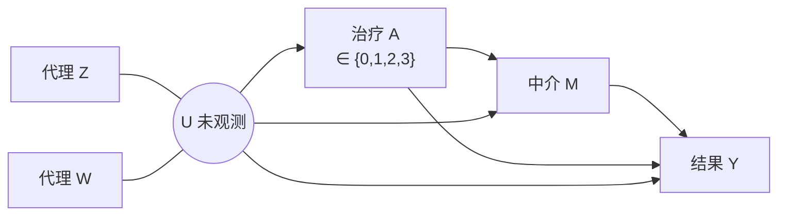
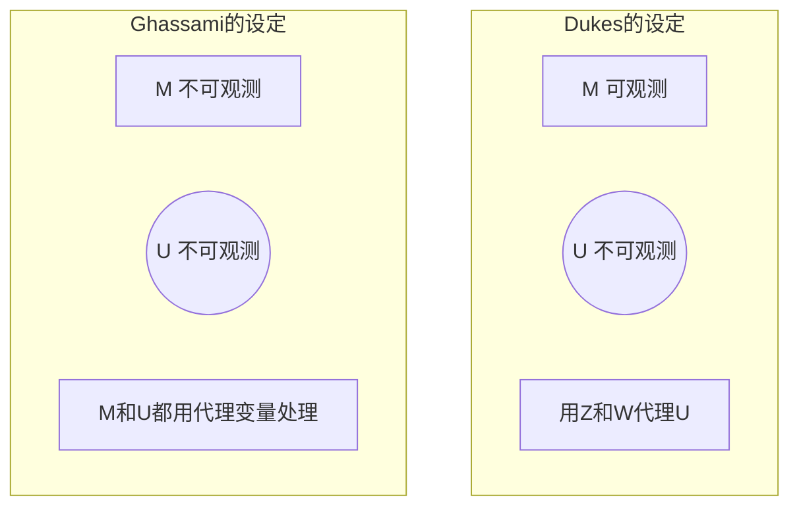
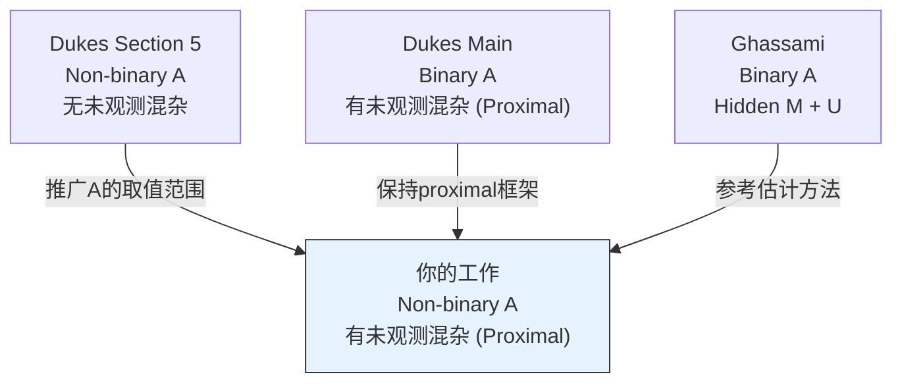

# Topic 4: Multiple Treatment Mediation Analysis

> 多分类处理变量下的中介分析 | 难度 ★★☆

## 目录

- [研究背景](#研究背景)
- [论文一: Dukes et al. 2023 (Proximal Mediation)](#论文一-dukes-et-al-2023)
- [论文二: Ghassami et al. 2025 (Hidden Mediators)](#论文二-ghassami-et-al-2025)
- [现有Gap与研究方向](#现有gap与研究方向)
- [如何推进这个方向](#如何推进这个方向)

---

## 研究背景

现有的proximal mediation analysis只考虑了二分类的治疗变量: A 只能取 0(不治疗)或 1(治疗). 但很多临床场景中, 治疗有多个水平:

- 药物剂量: 不用药 / 20mg / 50mg / 100mg (A = 0, 1, 2, 3)
- 治疗方案: 手术 / 放疗 / 化疗 / 联合治疗 (A = 0, 1, 2, 3)
- 干预强度: 无干预 / 轻度 / 中度 / 强度 (A = 0, 1, 2, 3)

当A有多个水平时, 分析比binary情况复杂得多. 比如你不能简单地把A=2和A=0的样本拿出来比较, 因为A=1和A=3的样本也包含关于A=2效应的信息.

### 问题结构



---

## 论文一: Dukes et al. 2023

**Proximal Mediation Analysis**

UPenn + Johns Hopkins | arXiv 2023 | 文件: Proximal Mediation Analysis.pdf | 53页

### 主要内容回顾

这篇论文的详细综述见题目5的文档, 这里只总结与题目4直接相关的部分.

核心设定:
- A 是二分类治疗 (0或1)
- M 是中介变量(可观测)
- U 是未观测混杂
- Z, W 是U的代理变量

论文的三大贡献:
1. 三种识别策略(双outcome bridge, 双treatment bridge, 混合)
2. 半参数有效影响函数(EIF)的推导
3. 多重稳健(PMR)估计量的构造

### Section 5: Non-binary Treatment (关键部分)

这是题目4最需要关注的部分. Dukes在论文最后一个section自己做了一个推广: 把A从{0,1}推广到{0,1,...,K}.

但有一个重要限制: 这个推广是在**不存在未观测混杂**的标准设定下做的, 不是在proximal框架下.

#### Section 5的具体做法

在non-proximal设定下, mediation functional可以表示为:

```
ψ(a, a') = Σ_{a''} E[Y | A=a, M=m, L=l] · f(M=m | A=a'', L=l) · P(A=a'' | L=l) dm dl
```

其中a是直接路径上的treatment值, a'是间接路径上的treatment值, a''是对A的各个水平求和.

当A只有两个水平时, 求和只有两项. 当A有K+1个水平时, 求和有K+1项, 每项的权重由P(A=a''|L)决定.

#### 关键观察

Ghassami et al. (2025) 的论文中也独立做了类似的推广(在另一个设定下). 他们的Section 5标题是 Extensions to non-binary exposures, 处理思路类似.

这意味着non-binary treatment的推广思路是成熟的, 只是在proximal框架下还没有人做过.

---

## 论文二: Ghassami et al. 2025

**Causal Inference with Hidden Mediators**

Ghassami, Yang, Shpitser, Tchetgen Tchetgen | Biometrika 2025 | 文件: asae037.pdf | 18页

### 与Dukes的区别



| 维度 | Dukes | Ghassami |
|------|-------|---------|
| 中介M | 可观测 | 不可观测, 只有代理 |
| 混杂U | 不可观测, 用Z和W | 不可观测, 用代理 |
| 处理A | Binary (0/1) | Binary (0/1) |
| 发表 | arXiv 2023 | Biometrika 2025 |

### 三个因果图 (Figure 1)

论文考虑了三种从简到繁的设定:

图(a): M不可观测, 但A和Y之间没有直接效应, 也没有U
- 最简单的情况
- front-door criterion的推广

图(b): M不可观测, A和Y之间有直接效应, 但没有U
- 中等复杂度
- 需要同时处理直接和间接效应

图(c): M不可观测, 有直接效应, 也有U
- 最复杂
- 对应完整的proximal设定

### 识别方法

对于图(c)的设定, Ghassami使用了和Dukes类似的桥函数技术. 不同之处在于: 除了U的桥函数之外, 还需要M的桥函数(因为M也看不到).

论文推导了对应的影响函数(influence function), 并分析了估计量的鲁棒性.

### 广义中介模型 (Generalized Mediation Model)

这个模型在图(c)的设定下, 给出了一个统一的中介效应表达式:

```
θ(a, a') = Σ_{a''} ∫ E[Y | A=a, M_proxy, L] · f(M_proxy | A=a'', L) · P(A=a'' | L) dM_proxy dL
```

这里的M_proxy是M的代理变量, 不是M本身.

注意这个公式里有一个对A的求和. 当A是binary时, 求和只有两项. 当A是多分类时, 需要更多项.

---

## 现有Gap与研究方向



### Gap: Proximal框架下的多分类treatment中介分析

目前的情况:
- Dukes: 在proximal框架下做了binary treatment的中介分析 (完整)
- Dukes Section 5: 在non-proximal框架下做了multi-treatment的中介分析 (完整)
- 在proximal框架下的multi-treatment中介分析: 没有人做

meeting中明确说了: 这个gap存在, 而且创新点虽然不大, 但确实没有人填.

### 为什么创新点不大

因为本质上是把两个已有结果组合起来. Dukes已经有了proximal框架, 也已经有了non-binary的推广思路, 你只需要把后者搬到前者的框架下. 技术难度在于: 桥函数的数量和形式在多分类时会变复杂, 需要仔细处理.

### 为什么仍然值得做

1. 确实是一个gap, 没有人填过
2. 多分类treatment在临床中很常见
3. 可以投会议论文(NeurIPS/ICML workshop)
4. 对于你来说是一个很好的练习, 能深入理解proximal mediation的技术细节

---

## 如何推进这个方向

### 技术路线

#### Step 1: 理解binary case的完整推导

精读Dukes论文Section 2-4, 搞清楚:
- bridge function的定义方程是怎么来的
- EIF是怎么推的(至少理解结构, 不需要重新推)
- PMR估计量的构造逻辑

#### Step 2: 理解Section 5的non-binary推广

搞清楚:
- mediation functional在多分类A下怎么定义
- 识别公式里的求和结构
- 与binary case的具体区别在哪里

#### Step 3: 在proximal框架下做multi-treatment推广

需要做的修改:
- bridge function的定义方程需要适配多分类A
- 在binary case中, I(A=1)和I(A=0)分成两项; 在multi-treatment case中, 需要对每个treatment level分别处理
- EIF的形式需要相应调整
- PMR的multiply robust条件需要重新验证

#### Step 4: 估计和模拟

- 实现新的估计量
- 设计模拟实验(DGP中A取0,1,2,3)
- 与naive方法(只用部分样本)比较

### 论文结构预期

```
Introduction: 多分类treatment在临床中的普遍性
Background: Proximal mediation (binary) + Non-binary扩展
Method: 
  - 多分类下的mediation functional定义
  - Proximal框架下的识别结果
  - PMR估计量的构造
  - Multiply robust性质的验证
Simulation:
  - A ∈ {0,1,2,3} 的DGP设计
  - 与naive方法(只用a=0和a=k的子集)比较
  - 展示利用全部样本的效率增益
Discussion: 推广到连续treatment的可能性
```

### 预期时间

比题目5略长, 因为需要做一些推导工作(虽然是在已有结果基础上的推广). 预计3-4个月.

### 与题目5的互补关系

题目5做的是CATE(把ATE局部化到个体), 题目4做的是多分类treatment. 如果两个都做了, 自然的下一步是: 在proximal框架下, 对多分类treatment估计条件中介效应. 这可以写到Discussion的Future Work里.

> 这个题目"比较好做也相对好发", 但也提醒"创新点比较小". 适合作为第二篇论文, 在题目5之后开始.
