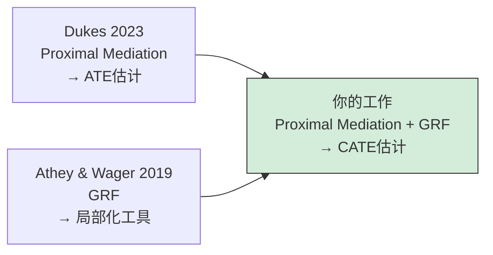
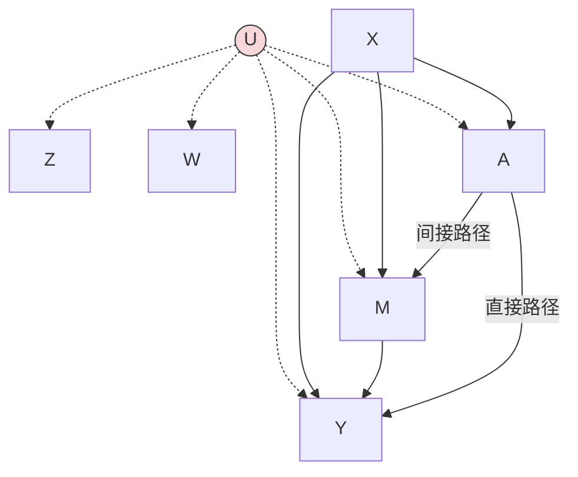
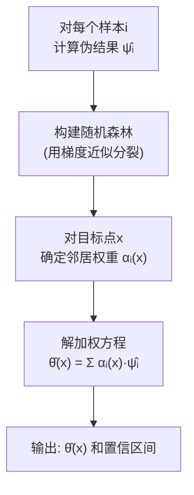
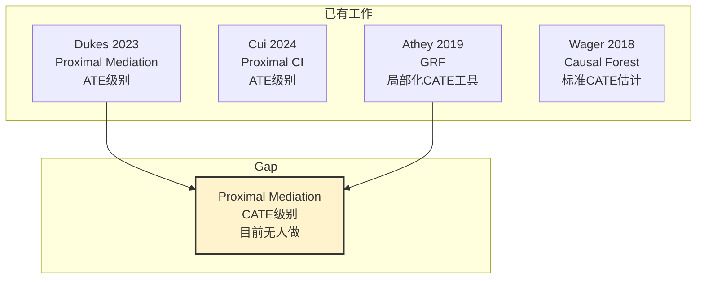
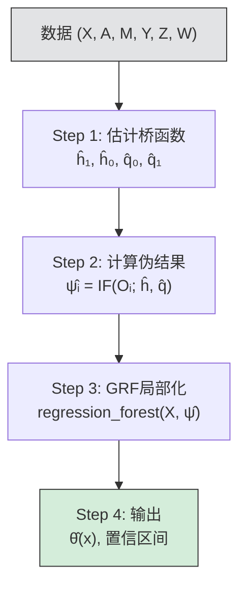

# Topic 5: Conditional Mediation Effect Estimation with GRF

> 基于广义随机森林的条件中介效应估计 | 难度 ★☆☆

## 目录

- [研究背景](#研究背景)
- [论文一: Dukes et al. 2023 (Proximal Mediation)](#论文一-dukes-et-al-2023)
- [论文二: Athey, Tibshirani & Wager 2019 (GRF)](#论文二-athey-tibshirani--wager-2019)
- [论文三: Ghassami et al. 2025 (Hidden Mediators)](#论文三-ghassami-et-al-2025)
- [现有Gap与研究方向](#现有gap与研究方向)
- [如何推进这个方向](#如何推进这个方向)

---

## 研究背景

在精准医疗中, 我们不仅想知道一个治疗通过某条路径的平均效应有多大(ATE级别), 更想知道对于每一个具体的患者, 这个路径效应是多少(CATE级别). 比如, 降压药通过降低血压来减少心脏病风险, 但这个间接效应对于50岁男性和70岁女性可能完全不同.

现有的proximal mediation方法只能回答前一个问题(群体平均), 无法回答后一个问题(个体化). 这个题目的目标就是填补这个gap.

### 核心思路



---

## 论文一: Dukes et al. 2023

**Proximal Mediation Analysis**

Dukes, Shpitser, Tchetgen Tchetgen | UPenn + Johns Hopkins | arXiv 2023 | 53页

### 问题设定

观测数据: n个独立样本 {(Xᵢ, Aᵢ, Mᵢ, Yᵢ, Zᵢ, Wᵢ)}

```
X = 协变量向量 (年龄, 性别, BMI等)
A ∈ {0,1} = 二分类治疗
M = 中介变量 (如血压)
Y = 结果 (如心脏病事件)
Z = treatment-inducing proxy (与U相关, 不直接影响Y)
W = outcome-inducing proxy (与U相关, 不直接影响A)
U = 未观测混杂 (无法直接测量)
```

因果图:



虚线箭头表示U对各变量的影响. 因为U看不到, 传统的条件独立性方法会产生偏差.

### 估计目标

论文关注的核心量是 mediation functional:

```
ψ = E[Y{1, M(0)}]
```

含义: 所有人都接受治疗(A=1), 但中介变量保持在不治疗时的水平M(0), 此时的平均结果.

有了ψ可以分解总效应:

```
总效应 = E[Y(1)] - E[Y(0)]
       = {E[Y{1,M(1)}] - E[Y{1,M(0)}]}  +  {E[Y{1,M(0)}] - E[Y{0,M(0)}]}
       =           NIE                    +            NDE
       = 自然间接效应(通过M)              + 自然直接效应(绕过M)
```

### 六大假设

| 编号 | 名称 | 含义 |
|------|------|------|
| 1 | Consistency | 观测值等于对应潜在结果 |
| 2 | Positivity | 每种治疗在任何亚组中都有正概率 |
| 3 | Latent Exchangeability | 给定U和X后, 治疗与潜在结果独立 |
| 4 | Latent Cross-world | 跨世界独立性(中介分析特有) |
| 5 | Proxy Conditions | Z和W满足特定的条件独立性 |
| 6 | Completeness | 代理变量相对于U信息量充分 |

### 四个桥函数

桥函数是连接观测数据和未观测U的数学桥梁. 每个桥函数通过一个积分方程(Fredholm方程)定义.

**h₁(W, M, X)**: 第一个outcome bridge

定义方程:
```
E(Y | Z, A=1, M, X) = ∫ h₁(w, M, X) dF(w | Z, A=1, M, X)
```

直觉: 在治疗组(A=1)中, Y关于Z的条件期望, 可以表示为h₁关于W的积分. h₁是Y在proximal意义下的回归函数.

**h₀(W, X)**: 第二个outcome bridge

定义方程:
```
E{h₁(W, M, X) | Z, A=0, X} = ∫ h₀(w, X) dF(w | Z, A=0, X)
```

直觉: 在对照组(A=0)中, 对h₁关于M积分后再关于Z做条件期望, 可以用h₀表示. h₀把M的信息也边际化掉了.

**q₀(Z, X)**: 第一个treatment bridge

定义方程:
```
1 / P(A=0 | W, X) = E{q₀(Z, X) | W, A=0, X}
```

直觉: 对照组中, 倾向评分的倒数可以用q₀关于Z的条件期望表示. q₀是逆概率加权在proximal框架下的对应物.

**q₁(Z, M, X)**: 第二个treatment bridge

定义方程涉及q₀和概率比值, 技术上更复杂. 它进一步考虑了M的作用.

### EIF公式 (核心)

```
IF_ψ = I(A=1) · q₁(Z,M,X) · {Y - h₁(W,M,X)}
     + I(A=0) · q₀(Z,X) · {h₁(W,M,X) - h₀(W,X)}
     + h₀(W,X) - ψ
```

逐项含义:

| 项 | 何时激活 | 直觉 |
|---|---------|------|
| I(A=1)·q₁·{Y - h₁} | 治疗组 | 用treatment权重加权的outcome残差. 如果h₁估得好, 残差接近零 |
| I(A=0)·q₀·{h₁ - h₀} | 对照组 | 用treatment权重加权的两个bridge的差. 如果h₀估得好, 差接近零 |
| h₀(W,X) | 所有样本 | 基于outcome bridge的基线估计 |
| -ψ | 常数项 | 使得E[IF_ψ] = 0 |

### PMR估计量

```
ψ̂ = (1/n) Σᵢ {I(Aᵢ=1)·q̂₁(Zᵢ,Mᵢ,Xᵢ)·(Yᵢ - ĥ₁(Wᵢ,Mᵢ,Xᵢ))
             + I(Aᵢ=0)·q̂₀(Zᵢ,Xᵢ)·(ĥ₁(Wᵢ,Mᵢ,Xᵢ) - ĥ₀(Wᵢ,Xᵢ))
             + ĥ₀(Wᵢ,Xᵢ)}
```

Multiply robust条件: 以下三组中任意一组正确即可保证一致性

| 组 | 正确估计的函数 |
|---|-------------|
| 组1 | h₁ 和 h₀ |
| 组2 | h₁ 和 q₀ |
| 组3 | q₁ 和 q₀ |

### 从ATE到CATE的gap

PMR估计量对所有样本等权求平均, 得到ψ̂ = 群体平均的mediation functional. 这是ATE级别的.

如果我们想要CATE级别的, 即 θ(x) = E[Y{1,M(0)} | X=x], 不能简单地在公式里代入X=x, 因为IF_ψ中包含了Yᵢ, 你给了一个新的x但没有对应的Y.

这就是GRF登场的地方.

---

## 论文二: Athey, Tibshirani & Wager 2019

**Generalized Random Forests**

Stanford University | Annals of Statistics 2019 | 31页

### 核心思想

GRF把随机森林从一个预测工具推广为一个通用的非参数估计工具. 它可以估计任何由局部矩方程定义的量.

### 数学框架

给定数据 {(Xᵢ, Oᵢ)}, 要估计 θ(x) 满足:

```
E[ψ_{θ(x)}(Oᵢ) | Xᵢ = x] = 0
```

其中 ψ 是一个已知的评分函数, O 包含所有观测量, θ(x) 是我们想要的目标.

### 算法流程



#### 权重如何计算

对于目标点x, GRF通过森林中的所有树来确定权重:

```
αᵢ(x) = (1/B) Σ_{b=1}^{B} [1{Xᵢ和x在第b棵树的同一叶节点}] / |L_b(x)|
```

B 是树的总数, L_b(x) 是第b棵树中包含x的叶节点里的样本集合.

直觉: 如果样本i和目标点x经常落在同一个叶节点, 说明它们很相似, 权重就大.

#### 分裂准则

GRF不用标准的CART分裂规则(最小化MSE), 而是用梯度近似:

1. 在父节点用当前参数估计, 计算每个样本的梯度(pseudo-label)
2. 对这些pseudo-label做标准CART分裂

好处: 分裂方向自动对准 θ(x) 的异质性方向, 而不是Y本身的异质性方向.

### 理论性质

在一定正则条件下:
1. 一致性: θ̂(x) → θ(x) 当 n → ∞
2. 渐近正态性: √n · (θ̂(x) - θ(x)) → N(0, σ²(x))
3. 方差估计: σ̂²(x) 可以用森林内部信息一致估计
4. 置信区间: θ̂(x) ± z_{α/2} · σ̂(x) 是有效的

### 与KNN和Kernel方法的对比

| 特性 | KNN | Kernel | GRF |
|------|-----|--------|-----|
| 邻居定义 | 固定的欧氏距离 | 固定的核函数 | 森林自动学习 |
| 维度适应性 | 差(维度灾难) | 差 | 较好 |
| 方向自适应 | 无 | 无 | 有(自动发现重要方向) |
| 理论保证 | 有 | 有 | 有 |
| 置信区间 | 不直接提供 | 有但保守 | 直接提供 |
| 实现 | 简单 | 简单 | grf包(R/C++) |

### grf软件包

R包, 在CRAN上可直接安装.

核心函数:
- `causal_forest()`: 估计CATE
- `regression_forest()`: 非参数回归
- `instrumental_forest()`: 工具变量
- 自定义: 可以提供自己的ψ函数

对于题目5, 最直接的做法是: 先算好每个样本的伪结果ψ̂ᵢ, 然后用`regression_forest(X, psi_hat)`做局部平均.

---

## 论文三: Ghassami et al. 2025

**Causal Inference with Hidden Mediators**

Biometrika 2025 | 18页

### 与题目5的关联

这篇论文与题目5没有直接的技术关联(题目5基于Dukes, 不基于Ghassami). 但需要在论文中引用, 因为:

1. 它是proximal mediation领域的重要相关工作
2. 它也只做了ATE, 同样没有做CATE
3. 你的GRF方法原则上也可以应用到Ghassami的框架中(作为future work)

在论文的Related Work部分一句话提到即可:

```
Ghassami et al. (2025) extend proximal mediation to settings where 
the mediator itself is unobserved. Our GRF-based approach can 
potentially be adapted to their framework.
```

---

## 现有Gap与研究方向

### Gap的可视化



### 为什么这个Gap存在

1. Proximal mediation是2023年才出来的比较新的工作
2. GRF虽然是2019年的, 但与proximal框架的结合需要对两边都有了解
3. 做因果推断的人和做机器学习的人往往在不同的圈子, 交叉较少

### 为什么这个Gap好填

1. 技术上是两个成熟工具的组合, 不需要新的理论突破
2. EIF公式Dukes已经推好了, GRF的接口Athey已经实现了
3. 主要工作量在代码实现和模拟实验

---

## 如何推进这个方向

### 完整的方法流程



### Step 1 的实现细节

桥函数的估计是最关键(也最难)的一步. 几种方法:

| 方法 | 复杂度 | 灵活性 | 推荐场景 |
|------|--------|--------|---------|
| 线性模型 + 两阶段最小二乘 | 低 | 低 | 先让pipeline跑通 |
| Kernel Ridge Regression | 中 | 中 | 正式实验 |
| 神经网络 | 高 | 高 | 如果维度很高 |

建议先用线性模型让整个流程跑通, 确认逻辑正确后再换成更灵活的方法.

### Simulation设计

| 场景 | CATE函数 | 维度 | 目的 |
|------|---------|------|------|
| 1 | θ(x) = 1 + 0.5·x₁ | p=5 | 简单线性, 所有方法都应该做得不错 |
| 2 | θ(x) = sin(x₁)·(1+x₂) | p=5 | 非线性+交互, GRF应有优势 |
| 3 | θ(x) = sin(x₁)·(1+x₂) | p=20 | 高维, 测试维度鲁棒性 |
| 4 | θ(x) = 0.3·I(x₁>0) | p=5 | 阶跃函数, 测试非光滑CATE |

每个场景跑500次重复, 每次n=1000.

### 评估指标

```
Bias(x) = E[θ̂(x)] - θ(x)
RMSE(x) = sqrt(E[(θ̂(x) - θ(x))²])
Coverage = P(θ(x) ∈ CI(x))  (应接近95%)
CI Length = 置信区间的平均宽度
```

在一组固定的测试点上计算这些指标, 然后对测试点取平均.

### Baseline方法

1. POR (Proximal Outcome Regression): 用ĥ₀做条件估计, 一阶方法, 不稳健
2. Naive Kernel: 用核平滑做局部化, 受维度灾难影响
3. Oracle (可选): 假设U可观测, 用标准方法做条件中介分析

### 论文结构

```
4-6页 workshop paper

Abstract: 150-200词
Section 1: Introduction (1页)
  - 精准医疗需要个体化中介分析
  - 现有方法只能做ATE, 不能做CATE
  - 我们提出GRF + Proximal Mediation
Section 2: Background (1页)
  - 2.1 Proximal Mediation (设定, 假设, EIF)
  - 2.2 GRF (框架, 权重, 理论性质)
Section 3: Method (1页)
  - 3.1 GRF-based条件中介效应估计
  - 3.2 算法伪代码
Section 4: Experiments (1.5页)
  - 4.1 Setup (DGP, 场景, baseline)
  - 4.2 Results (表格 + 图)
Section 5: Discussion (0.5页)
  - 总结, 局限性, future work
References: 15-20篇
```

### 时间线

| 周次 | 任务 | 产出 |
|------|------|------|
| 1-2 | 读Dukes(找EIF) + 读GRF + 装grf包 | 理解框架 |
| 3 | 写DGP代码, 设计4个场景 | dgp.R |
| 4 | 实现bridge function估计 | bridges.R |
| 5 | 实现完整algorithm, 跑第一个场景 | main.R |
| 6 | 实现baseline, 跑所有场景 | baselines.R |
| 7 | 做图做表 | figures/ |
| 8 | 写论文初稿 | draft_v1.tex |
| 9 | 给导师看, 改稿 | draft_v2.tex |
| 10 | 定稿投稿 | final.tex |

> 最大的技术瓶颈在第4周: bridge function的估计. 建议参考Cui et al. (2024)的supplementary code, 或者直接问吴思涵要.

---

## 总结

题目5是五个候选题目中最容易上手的. 核心工作是把两个成熟的工具(Dukes的EIF + Athey的GRF)组合起来, 不需要推新定理, 主要工作量在代码实现和模拟实验. 预计2-3个月可以完成, 适合投NeurIPS/ICML workshop.
